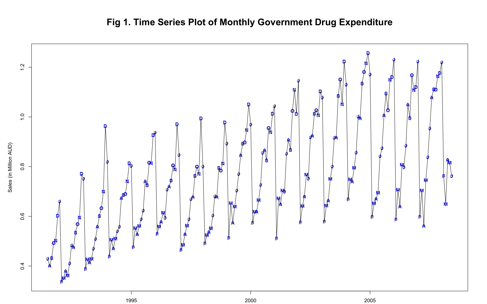
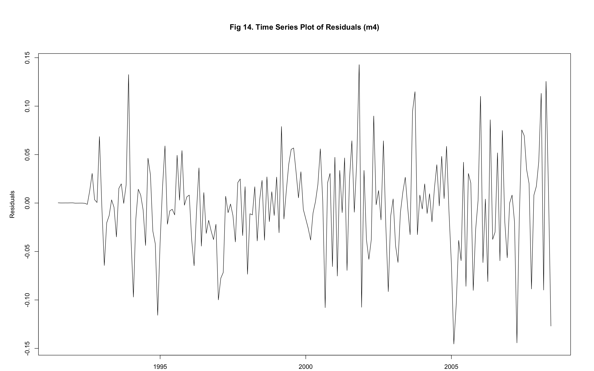

# Forecasting Monthly PBS Corticosteroid Expenditure Using SARIMA Modelling

A complete time series analysis and forecasting project submitted for **MATH1318: Time Series Analysis** at RMIT University. The project applies SARIMA modelling to forecast 10 months of Australian government pharmaceutical expenditure, following a structured residual-based model-building approach.

---

## 📌 Table of Contents

- [Project Overview](#-project-overview)
- [Dataset](#-dataset)
- [Repository Structure](#-repository-structure)
- [Methodology](#-methodology)
- [Key Plots](#-key-plots)
- [Tech Stack](#️-tech-stack)
- [How to Run](#-how-to-run-the-analysis)
- [Key Results](#-key-results)
- [Author](#-author)

---

## 📋 Project Overview

The Australian Government subsidises corticosteroid medications through the **Pharmaceutical Benefits Scheme (PBS)**. This project analyses monthly PBS expenditure on corticosteroids from **July 1991 to June 2008** and forecasts spending for the following 10 months (July 2008 – April 2009).

**Research Question:**
> What is the most accurate SARIMA model for forecasting the next 10 months of PBS corticosteroid expenditure in Australia?

**Key Finding:**
The model **SARIMA(4,1,1)×(2,1,1)[12]** was selected as the best-performing model, consistently ranking first across AIC, BIC, RMSE, and MAE criteria. Forecasts confirmed the expected seasonal pattern, with peak expenditure in December–January and a dip in early 2009.

---

## 📊 Dataset

- **Source:** `h02` dataset from the `fpp2` R package
- **Period:** July 1991 – June 2008 (204 months)
- **Variable:** Monthly government spending on corticosteroids (Million AUD)
- **Missing values:** None

---

## 📁 Repository Structure

```
time-series-pbs-forecasting/
│
├── README.md                            ← You are here
├── final.R                              ← Main analysis script (full pipeline)
│
├── modules/                             ← Module task scripts from the course
│   ├── solutionModule1Tasks_2024.R
│   ├── solutionModule2Tasks_2025.R
│   ├── solutionModule3Tasks_2025.R
│   ├── solutionModule4Tasks_2024.R
│   ├── solutionModule5Tasks_2025.R
│   ├── solutionModule6Tasks_2025.R
│   ├── solutionModule7Tasks_2025_V2.R
│   ├── solutionModule8_Tasks_2025.R
│   └── solutionModule9Tasks_2025.R
│
├── report/                              ← Written report and assignment documents
│   ├── s4033538-PBS-FINAL.pdf           ← Submitted final report (PDF)
│
├── presentation/                        ← Presentation files
│   ├── s4033538_final.pdf
│   └── s4033538_final.mp4               ← Recorded presentation video
│
└── figures/                             ← All plots and figures generated by R
```

---

## 🔬 Methodology

The analysis follows a **residual-based SARIMA model-building approach** — a step-by-step method that builds model complexity only where the data demands it.

### Steps Followed

1. **EDA** — Time series plot, summary statistics, lag-1 scatter plot
2. **Stationarity & Normality** — ADF test, ACF/PACF, Shapiro-Wilk, Q-Q plot
3. **Model Specification** — Residual approach, four progressive models (m1 → m4)
4. **EACF Analysis** — Candidate (p, q) combinations identified
5. **BIC Plot** — Optimal AR/MA orders confirmed via heatmap
6. **Model Fitting** — 7 SARIMA models fitted using ML and CSS
7. **Model Evaluation** — AIC, BIC, RMSE, MAE, MAPE, MASE, coefficient tests
8. **Over-parameterisation Check** — Confirmed simpler model performs best
9. **Forecasting** — 10-month forecast with 80% and 95% prediction intervals

### Candidate Models Evaluated

| Model | Source | AIC |
|---|---|---|
| SARIMA(4,1,1)×(2,1,1)[12] | BIC Table ✅ **Best** | −569.37 |
| SARIMA(0,1,6)×(2,1,1)[12] | EACF | −568.28 |
| SARIMA(4,1,2)×(2,1,1)[12] | BIC Table | −567.41 |
| SARIMA(1,1,4)×(2,1,1)[12] | EACF | −566.99 |
| SARIMA(4,1,3)×(2,1,1)[12] | Residual Approach | −565.42 |
| SARIMA(1,1,5)×(2,1,1)[12] | EACF | −564.99 |
| SARIMA(0,1,5)×(2,1,1)[12] | EACF | −564.19 |

---

## 📉 Key Plots

### Time Series Plot of Raw Data


### ACF and PACF Plots


### Q-Q Plot (Normality Check)


### Full SARIMA Model Residuals (m4)


### 10-Month Forecast


---

## 🛠️ Tech Stack

| Tool | Purpose |
|---|---|
| **R** | All analysis, modelling, and visualisation |
| **fpp2** | Source of the `h02` dataset (PBS corticosteroids) |
| **forecast** | SARIMA model fitting and forecasting (`Arima()`, `forecast()`) |
| **TSA** | ACF/PACF diagnostics, EACF table, BIC plot (`armasubsets()`) |
| **tseries** | Stationarity testing (`adf.test()`) |
| **lmtest** | Coefficient significance testing (`coeftest()`) |
| **ggplot2** | Forecast visualisation (`autoplot()`) |

---

## 🚀 How to Run the Analysis

### Prerequisites

Make sure you have R (version ≥ 4.0) and RStudio installed.

Install the required packages by running this in your R console:

```r
install.packages(c("fpp2", "forecast", "TSA", "tseries", "lmtest"))
```

### Running the Main Script

1. Clone or download this repository
2. Open `final.R` in RStudio
3. Update the working directory path to match your local folder:

```r
setwd("/your/local/path/to/this/project")
```

4. Run the full script — it will:
   - Load and explore the `h02` dataset
   - Perform all diagnostic checks and plots
   - Fit all 7 candidate SARIMA models
   - Print AIC/BIC comparison tables and accuracy metrics
   - Generate the 10-month forecast with confidence intervals

---

## 📊 Key Results

### Best Model: SARIMA(4,1,1)×(2,1,1)[12]

- **AIC:** −569.37 (lowest among all candidates)
- **BIC:** −540.10 (lowest among all candidates)
- **RMSE:** 0.049 | **MAE:** 0.036 | **MAPE:** 4.761%
- 6 out of 8 parameters statistically significant under ML
- Residuals showed no autocorrelation (Ljung-Box p-values well above 0.05)
- Only mild non-normality (Shapiro-Wilk p = 0.0067) — acceptable for forecasting

### 10-Month Forecast (Jul 2008 – Apr 2009)

| Month | Point Forecast | 80% CI | 95% CI |
|---|---|---|---|
| Jul 2008 | 1.031 | [0.965, 1.098] | [0.929, 1.133] |
| Dec 2008 | 1.228 | [1.144, 1.311] | [1.100, 1.355] |
| Feb 2009 | 0.704 | [0.619, 0.789] | [0.574, 0.833] |
| Apr 2009 | 0.772 | [0.686, 0.859] | [0.640, 0.905] |

Expenditure is in millions of AUD. Forecasts follow the expected seasonal pattern — peaking in December–January and dipping in early 2009.

---

## 📄 License

This project was submitted as academic coursework at RMIT University. The code and report are shared for portfolio and educational purposes. Please do not submit any part of this work as your own for academic assessment.

---

## 🤖 Use of AI Tools

ChatGPT (OpenAI) was used for limited technical assistance during development:
- Debugging `fpp2`/`FitAR` installation issues on Apple Silicon (M1/M2)
- Identifying a compatible substitute for `FitAR::LjungBox` (replaced with base R's `Box.test()`)
- Clarifying plot formatting options in base R

All analysis, modelling decisions, code, and report writing were completed independently. AI was used only as a technical reference tool, not to generate outputs or conclusions.

---

## 👤 Author

**Kamlesh Appasaheb Kale** <br>
RMIT University — MATH1318 Time Series Analysis